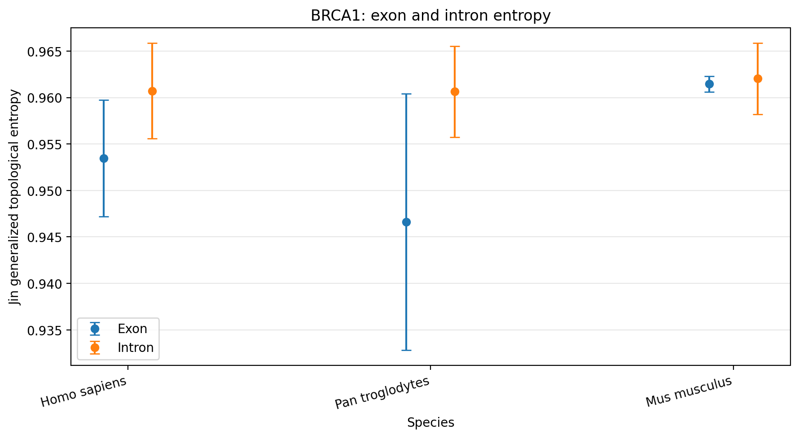
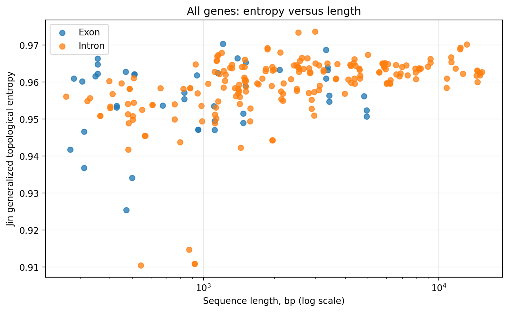
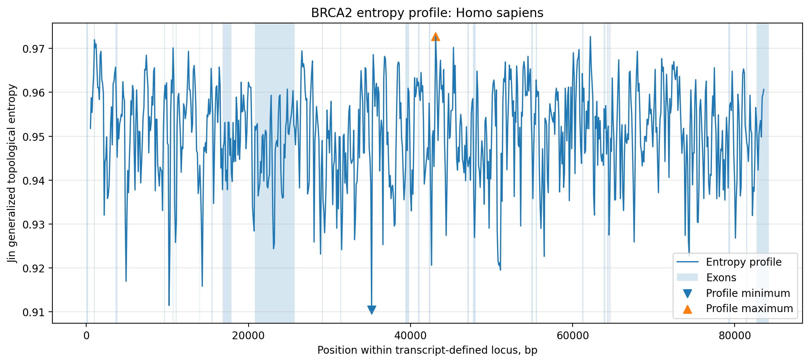
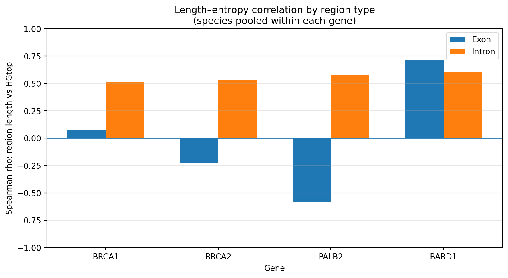

# BRCA Entropy Analysis

A reproducible Python project for comparative analysis of exon and intron
sequence complexity in BRCA-associated genes.

The project is based on my graduation research at the Faculty of Physics,
Lomonosov Moscow State University.

## Project objective

The objective was to investigate whether topological entropy methods can
detect structural differences between exons and introns of orthologous genes
and to evaluate how strongly the results depend on sequence length.

## Data

The analysis includes four BRCA-associated genes:

- BRCA1
- BRCA2
- PALB2
- BARD1

for three species:

- Homo sapiens
- Pan troglodytes
- Mus musculus

The input data consists of publicly available annotated GenBank records.

## Analysis pipeline

1. Parse GenBank annotations.
2. Select one representative transcript for each gene and species.
3. Extract exon and intron sequences.
4. Validate sequence length and nucleotide composition.
5. Calculate Koslicki topological entropy.
6. Calculate Jin generalized topological entropy.
7. Build sliding-window entropy profiles.
8. Calculate descriptive statistics and Spearman correlation.
9. Generate summary tables and visualizations.

## Key findings

- Intron entropy was generally higher than exon entropy for the human and
  chimpanzee orthologs.
- The separation was weaker and less stable for mouse orthologs.
- Entropy estimates showed a moderate association with sequence length.
- Sliding-window profiles revealed local low-complexity regions that did not
  always coincide with exon boundaries.
- The results demonstrate both the potential and the limitations of entropy
  methods for comparative sequence analysis.

## Selected visualizations

### Exon and intron entropy across species

### Entropy and sequence length

### Local entropy profile

### Length–entropy correlations by region type

## Practical value

The project implements a reproducible workflow for processing annotated
biological data, applying validation rules, calculating analytical features
and identifying regions with atypical sequence complexity.

The method is intended for exploratory comparative analysis and is not a
standalone biological or diagnostic marker.

## Technologies

Python, pandas, NumPy, SciPy, Biopython, Matplotlib, Jupyter Notebook.

## Repository structure

- `data/` — input data and data description
- `notebooks/` — reproducible analysis notebook
- `figures/` — key visualizations
- `results/` — processed analytical results
- `docs/` — methodology and assumptions

## Author

Anastasia Rogacheva
